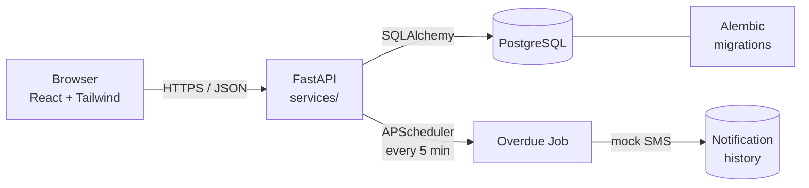

<div align="center">

# 📚 Library Management System

**A production-structured LMS that is still easy for beginners to read**

[](https://library-management-system-dun-iota-40.vercel.app/)
[](https://lms-backend-6xi9.onrender.com/docs)
[](https://lms-backend-6xi9.onrender.com)

[](./frontend)
[](./backend)
[](./backend)
[](./backend/tests)
[](./docker-compose.yml)

*React + FastAPI + PostgreSQL · 20-day loans · Auto overdue SMS · Rs 10/day fines · Works on PC & Phone*

[🚀 Live Frontend](https://library-management-system-dun-iota-40.vercel.app/) · [⚙️ Live Backend](https://lms-backend-6xi9.onrender.com) · [📖 Swagger](https://lms-backend-6xi9.onrender.com/docs) · [🐳 Docker](#-docker-one-command-startup)

</div>

---

## ✨ Live Demo

| | Link | What you get |
|---|---|---|
| **Frontend** | **https://library-management-system-dun-iota-40.vercel.app/** | Full app — login and try every flow on PC or phone |
| **Backend** | **https://lms-backend-6xi9.onrender.com** | REST API |
| **Swagger** | **https://lms-backend-6xi9.onrender.com/docs** | Try all endpoints live |

> ⏳ Render free tier sleeps after idle — first request may take ~30s, then it's instant.

<details>
<summary><b>🔑 Demo logins (click to show)</b></summary>

| Role | Username | Password | Staff ID |
|------|----------|----------|----------|
| **Admin** | `admin` | `Admin@123` | `STAFF-0001` |
| **Staff** | `staff` | `Staff@123` | `STAFF-0002` |

Admin can create staff → staff can do everything except staff management.

</details>

---

## 🎬 See it in 30 seconds

```
Login as admin → Staff → Add staff (STAFF-0003)
             → Students → Add student (STU-0000xx auto)
             → Categories → Books → Add book (BOOK-0000xx)
Login as staff → Issue Book → STU-000001 + BOOK-000001
              Due date = Today + 20 days  (automatic)
              Overdue? → /transactions/overdue + SMS in Notifications + Rs 10/day
              Return → fine shown → Fines → Pay (Cash/UPI) → PAID
              Audit Logs → every step recorded
```

---

## 🖼️ Screenshots

> Replace the placeholders with your own — just drop images in `docs/screenshots/` and they appear here.

| Dashboard | Issue & Due Date | Overdue & Fine |
|-----------|------------------|----------------|
|  |  |  |
| *Stats, issued today, overdue count* | *TXN-000001 · Due = Issue + 20 days* | *Badge OVERDUE + Rs 10/day live* |

| Students | Books | Fines |
|----------|-------|-------|
|  |  |  |

<details>
<summary>📱 Mobile — works as PWA</summary>

- Responsive drawer, 44px tap targets, 16px inputs (no iOS zoom)
- Add to Home Screen from phone browser — standalone, theme color `#2563eb`
- LAN: `http://<your-PC-IP>:5173` when `vite --host 0.0.0.0`

</details>

---

## 🧭 How it works



- **Frontend** `frontend/` — only UI. No business rules.
- **Backend** `backend/app/` — thin routes → `services/` where all rules live. JWT Bearer.
- **DB** — Postgres in Docker/prod, SQLite for local/tests via `DATABASE_URL`.
- **Overdue** — computed from dates (` (today - due).days * 10` ) — reruns are safe.

---

## 🧩 Features

| Area | Highlights |
|------|------------|
| **Auth** | Login/logout/`/me`/change-password, JWT, bcrypt, active/inactive, rate-limit on login |
| **Roles** | `ADMIN` (staff mgmt) vs `STAFF` (everything else) — enforced in backend, not just UI |
| **IDs** | Human-readable everywhere: `STAFF-0001` `STU-000001` `BOOK-000001` `CAT-000001` `TXN-000001` |
| **CRUD** | Students / Staff / Categories / Books — search, filter, pagination |
| **Books** | Title/author required, unique ISBN (10/13), `available ≤ total`, soft-disable |
| **Categories** | Delete blocked with `409` if books assigned — `Cannot delete category…` |
| **Issue** | Checks: student active, book active, copies >0, limit 5, no duplicate active issue |
| **20-day rule** | `due = issue + 20 days` (`LOAN_PERIOD_DAYS`) — shown on issue |
| **Overdue** | `today > due` → badge + SMS once → `overdue_days * Rs 10` |
| **Fines** | Saved on return, `UNPAID → PARTIALLY_PAID → PAID`, overpay blocked |
| **Student page** | Current issues, due dates, overdue, outstanding fine, full history |
| **Ops** | Dashboard, Transactions, Overdue list, Notifications, Audit Logs |

---

## 🗄️ Database

`users` · `staff` · `students` · `categories` · `books` · `book_transactions` · `fines` · `fine_payments` · `notifications` · `audit_logs`

`categories 1—* books` · `students 1—* transactions` · `books 1—* transactions` · `staff 1—* transactions` · `transaction 1—0/1 fine` · `fine 1—* payments`

Every `User` has one `Staff` row so “who did it” is uniform.

---

## 🔌 API — click to explore

<details>
<summary><b>Auth</b> · <code>POST /api/auth/login</code> · <code>GET /api/auth/me</code> · <code>POST /api/auth/change-password</code></summary>

```http
POST /api/auth/login  {username, password} → {access_token, user}
GET  /api/auth/me  (Bearer) → User
```

</details>
<details>
<summary><b>Students</b> · <code>/api/students</code> + history & fines</summary>

```
GET/POST /api/students
GET/PUT /api/students/{STU-000001}
PATCH /api/students/{id}/status
GET /api/students/{id}/history
GET /api/students/{id}/fines
```

</details>
<details>
<summary><b>Books / Categories / Staff / Transactions / Fines</b></summary>

```
Books:       GET/POST /api/books · GET/PUT/DELETE /api/books/{BOOK-000001}
Categories:  GET/POST /api/categories · DELETE blocked if books exist
Staff*:      GET/POST /api/staff  (*admin only)
Transactions: POST /api/transactions/issue {student_id, book_id}
              POST /api/transactions/{TXN-000001}/return → {fine}
              GET  /api/transactions/overdue
Fines:       GET /api/fines · POST /api/fines/{id}/payment · POST /api/fines/{id}/pay-in-full
```

</details>

Full interactive docs: **https://lms-backend-6xi9.onrender.com/docs** · ReDoc `/redoc` · OpenAPI `/openapi.json`

---

## 🛠️ Tech Stack

| Layer | Stack |
|-------|-------|
| **Frontend** | React 18 · Vite 6 · TypeScript · Tailwind 3 · React Router 6 · Hook Form + Zod · axios · lucide |
| **Backend** | Python · FastAPI · SQLAlchemy 2 · Alembic · Pydantic · PyJWT · bcrypt · APScheduler |
| **DB** | PostgreSQL 16 (Docker/Render) · SQLite for local/tests |
| **DevOps** | Docker & Compose · GitHub · Vercel (frontend) · Render (backend) |

---

## ⚡ Quick Start

### Local (without Docker)

**Backend**
```bash
cd backend
python -m venv .venv
.venv\Scripts\activate        # Windows — or: source .venv/bin/activate
pip install -r requirements.txt
copy ..\.env.example ..\.env  # edit if needed
set DATABASE_URL=sqlite:///./lms.db
python -m app.seed            # → admin / Admin@123 , staff / Staff@123
uvicorn app.main:app --reload # http://localhost:8000  docs at /docs
```

**Frontend**
```bash
cd frontend
npm install
npm run dev                   # http://localhost:5173  proxies /api → :8000
# LAN / phone: npm run dev -- --host 0.0.0.0  → http://<PC-IP>:5173
```

### 🐳 Docker (one command)

```bash
cp .env.example .env   # review secrets first
docker compose up --build
# Frontend http://localhost:3000  Backend http://localhost:8000  Docs /docs
```

Backend waits for Postgres (`pg_isready`), runs `alembic upgrade head`, seeds if `RUN_SEED=true`.

---

## 🔐 Env

See `.env.example` — `DATABASE_URL` · `JWT_SECRET` · `CORS_ORIGINS` · `LOAN_PERIOD_DAYS=20` · `FINE_PER_DAY=10` · `MAX_BOOKS_PER_STUDENT=5` · `SMS_PROVIDER` · `AUTO_CREATE_TABLES` · `RUN_SEED` · `VITE_API_URL`

---

## ✅ Tests

```bash
cd backend
pytest tests -q     # 59 tests — in-memory SQLite + FrozenClock (no 20-day wait)
```
Covers: login, RBAC, validation, category guard, issue/return, 20-day rule, stock, fines `0/1/4 days → Rs 0/10/40`, payments, overdue SMS once.

---

## 🎓 5-minute mentor demo

1. **Admin** → Staff → Add staff → `STAFF-0003`
2. **Students** → Add → `STU-0000xx`
3. **Categories → Books** → Add `BOOK-0000xx`
4. **Staff** → Issue `STU-…` + `BOOK-…` → note `Due = Issue + 20 days`
5. **Overdue** → badge + **Notifications** SMS + live `Rs 10/day`
6. **Return** → `Fine: Rs 40` → **Fines** → Pay → `PAID`
7. **Audit Logs** + **Swagger** live

---

## 🚀 Deploy

- **Backend → Render**: `render.yaml` at root auto-creates DB + service, or manual Web Service (`Docker`, `Dockerfile` at root). Set `DATABASE_URL`, `JWT_SECRET`, `CORS_ORIGINS=https://library-management-system-dun-iota-40.vercel.app`, `AUTO_CREATE_TABLES=false`.
- **Frontend → Vercel**: Root `frontend/`, Build `npm run build`, Output `dist`, Env `VITE_API_URL=https://lms-backend-6xi9.onrender.com` (SPA fallback in `frontend/vercel.json`).

---

## 🔮 Future

Barcode/QR, email/WhatsApp, multi-branch, waitlist, Excel/PDF exports, receipts, analytics, backups, admin-configurable loan/fine in UI.
